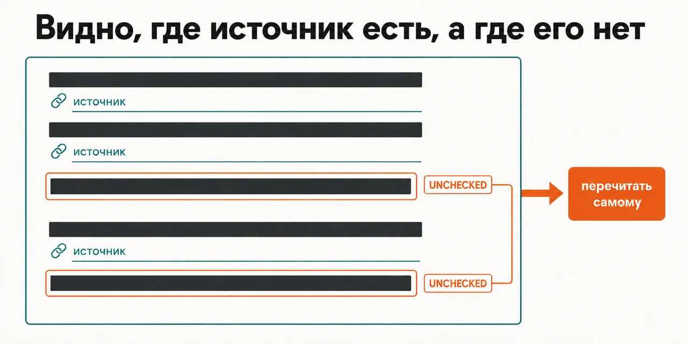
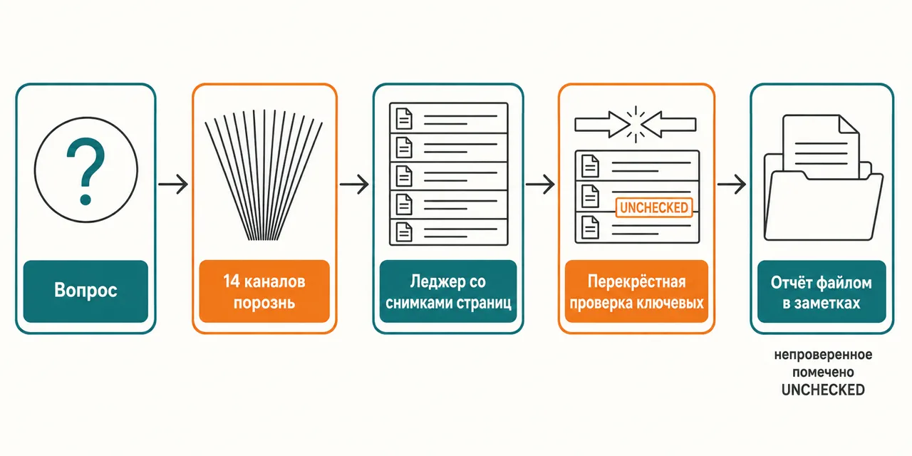

Русский · [English](README.en.md)

# Ответ звучит одинаково уверенно там, где источник есть, и там, где его нет

Ключевые утверждения проверяются перекрёстно, непроверенные помечены — 14 каналов идут порознь,
под каждой цитатой снимок страницы, а отчёт лежит файлом в твоих заметках, а не в переписке.

```
claude plugin marketplace add https://github.com/beCyborg/jadlis-start.git
claude plugin install search@jadlis --config BRAVE_API_KEY=... --config FIRECRAWL_API_KEY=...
claude plugin install research@jadlis
```

Ключи заводятся один раз, здесь: `search` ставится первым и сразу с ключами. Поставишь `research`
первым — `search` приедет прицепом, ключей у тебя не спросит, и первый прогон встанет на пустом
месте.



Текстом: страница отчёта — под каждым ключевым утверждением источник, непроверенные строки
помечены UNCHECKED; это и есть твой список на перечитать.

Это моё рабочее место, выложенное как есть, а не продукт: чем перестал пользоваться — убрал.

## Было → стало

| Руками | Чатом с ИИ | Этим плагином |
|---|---|---|
| **Откуда взялось утверждение.** Читаешь вкладки подряд и решаешь по той, что открыта последней. | Тон одинаково уверенный и там, где источник есть, и там, где его нет. | Ключевые утверждения проверяются перекрёстно, непроверенные помечены UNCHECKED — видно, что перечитать самому. |
| **Охват.** Идёшь по одному каналу и бросаешь, когда кончается терпение. | Тот срез, что попал в выдачу, — и не видно, чего в нём нет. | 14 каналов за прогон: веб три источника, форумы, микроблоги, новости разработчиков, рассылки, видео, каналы, языковые слои ja/zh/ko/eu. |
| **Спор между источниками.** Заметен, только если обе вкладки ещё открыты. | Сводится в один гладкий абзац, спор исчезает. | Расхождение между каналами видно в самом отчёте, а не за кадром. |
| **Через месяц.** Вкладка закрыта, ссылка мертва, а решение на этом утверждении стоит. | Переписка ушла вниз. | Леджер утверждений и снимок страницы под каждую цитату. |
| **Где живёт результат.** Вкладки, скриншоты и заметки — в разных местах. | В переписке, до следующей сессии. | Отчёт лежит файлом в твоих заметках и находится поиском по базе. |

Один вопрос ты сейчас задашь: а сам-то ты это мерил. Мерил, один раз и на себе. Замер
собственного конвейера, 18.08.2026: 94 отчёта, 754 ключевых утверждения проверено перекрёстно,
280 (37,1 %) отсеяно; медиана отсеянных на отчёт — 3, отчётов без отсева — 7. Как считалось:
отбирается до 16 ключевых утверждений на отчёт, непроверенные помечаются UNCHECKED. Это самозамер
собственного конвейера, без контрольной группы и внешней проверки.

## Как это работает



На входе — один вопрос.
Внутри — 14 каналов отрабатывают порознь, поэтому расхождение между ними видно, а не
усредняется; утверждения уходят в леджер, под каждой цитатой снимается страница, ключевые ищут
второй источник в другом канале.
На выходе — отчёт файлом в твоих заметках, где непроверенное помечено UNCHECKED.

Текстом: вопрос → 14 каналов порознь → леджер утверждений со снимками страниц → перекрёстная
проверка ключевых и пометка UNCHECKED на остальных → отчёт файлом в заметках.

<details>
<summary>Если бы это делали люди · Чем отличается от Perplexity, ChatGPT Deep Research и Grok · Пример</summary>

### Если бы это делали люди

| Роль | Сколько людей | Что здесь делает плагин |
|---|---|---|
| Поисковик по каналу | по человеку на канал: веб, форумы, микроблоги, новости разработчиков, рассылки, видео, каналы, японский, китайский, корейский, европейские языки | отрабатывает 14 каналов порознь за один прогон |
| Проверяющий цитаты | отдельный человек, который открывает каждую ссылку и сохраняет страницу | кладёт снимок страницы под каждую цитату |
| Сводящий | отдельный человек, который ищет ключевому утверждению второй источник и помечает спорное | проверяет ключевые утверждения перекрёстно, непроверенные помечает UNCHECKED |
| Редактор | отдельный человек, который собирает это в читаемый документ | кладёт отчёт файлом в твои заметки |

Про деньги здесь ничего не сказано намеренно: источников по стоимости такой работы я не собирал.

### Чем отличается от Perplexity, ChatGPT Deep Research и Grok

Сравнение только по механизмам — не по тому, кому верить.

| Механизм | Этот плагин | Perplexity | ChatGPT Deep Research | Grok |
|---|---|---|---|---|
| Виден ли источник под каждым ключевым утверждением | да, в леджере, плюс снимок страницы | да, нумерованные цитаты в ответе | да, цитаты или ссылки в каждом отчёте | частично: инлайн-цитаты не гарантированы |
| Ищется ли ключевому утверждению второй источник | да, перекрёстно, между каналами | частично: заявлен cross-reference, правила двух источников нет | в документации не нашёл | частично: cross-reference находок, режим в бете |
| Помечается ли то, что подтвердить не удалось | да, пометкой UNCHECKED | в документации не нашёл | нет: OpenAI сам пишет о слабой калибровке уверенности | в документации не нашёл |
| Остаётся ли леджер после прогона | да, файлом в твоих заметках | частично: отчёт с цитатами уходит файлом, но это не леджер | частично: раздел «источники» и история прогона | частично: список ссылок в ответе API, файла нет |

Столбец плагина проверен 07.09.2026. Три чужих столбца собраны в тот же день по официальной
документации: [Model Council](https://www.perplexity.ai/hub/blog/introducing-model-council) и
[справка Perplexity](https://www.perplexity.ai/help-center/en/articles/13600190-what-s-new-in-advanced-deep-research),
[справка OpenAI по Deep Research](https://help.openai.com/en/articles/10500283-deep-research-faq),
[docs.x.ai](https://docs.x.ai/developers/model-capabilities/text/multi-agent). «В документации не
нашёл» значит ровно это, а не «нет». «Нет» стоит в одной ячейке: OpenAI в разделе
ограничений сам пишет, что плохо передаёт неуверенность.

### Пример

Ты решаешь, брать ли конкретную добавку, про которую в ленте пишут уверенно и одинаково. Прогон
разносит вопрос по каналам порознь: обзоры в вебе, обсуждения на форумах, разборы в видео,
неанглоязычные слои. Утверждения вида «помогает при таком-то состоянии» и «принимают вот так»
уходят в леджер: у одних под строкой источник и снимок страницы, и совпадение пришло из разных
каналов; другие остаются с пометкой UNCHECKED — их не выкинули, а показали как то, что нужно
перечитать самому. Отчёт остаётся файлом в заметках, и через месяц видно не только вывод, но и
то, откуда он взялся.

</details>

## Установка и первый запуск

**а) Текст для вставки агенту.** Скопируй целиком в чат Claude Code:

```
Ты — установщик. Поставь на этот Mac плагин research из маркетплейса jadlis.
Сначала проверь, что стоит Claude Code и подписка активна; если нет — остановись и скажи об этом.
Дальше выполни ровно эти команды, дословно, ничего не сокращая:
1. claude plugin marketplace add https://github.com/beCyborg/jadlis-start.git
2. claude plugin install search@jadlis --config BRAVE_API_KEY=... --config FIRECRAWL_API_KEY=...
   Ключи Brave и Firecrawl я вставлю в команду сам. Значения ключей в ответ не печатай.
3. claude plugin install research@jadlis
4. claude plugin list — покажи мне строки про search и research с версиями.
Порядок не меняй: search ставится первым и с ключами. Если research подтянет его сам,
ключи он не спросит, и первый прогон встанет.
Перед каждой командой покажи её мне целиком и дождись «да». Сказал «нет» — не выполняй.
Команда вернула ошибку — остановись, покажи вывод, к следующей не переходи.
```

**б) Команды руками.**

```
claude plugin marketplace add https://github.com/beCyborg/jadlis-start.git
claude plugin install search@jadlis --config BRAVE_API_KEY=... --config FIRECRAWL_API_KEY=...
claude plugin install research@jadlis
claude plugin list
```

Первая команда ничего не ставит — она добавляет маркетплейс. Если `search` уже стоит без ключей,
сними и поставь заново со строкой `--config`: `claude plugin uninstall search@jadlis --keep-data`.

**в) Короткая команда.** Открой Claude Code в папке, где работаешь, и набери:

```
/research <твой вопрос одной фразой>
```

Не находится — сверь имя строкой `claude plugin list`. Первый прогон запускай на вопросе, который тебе действительно нужен: прогон тяжёлый,
и в фоне его не держат.

## Границы, стоимость, обновление

**Чего не делает.** Не решает за тебя: отчёт — основание для решения, а не решение. Не заменяет
специалиста там, где речь о здоровье, деньгах или праве. Не гарантирует полноты: каналов 14, а не
все, какие есть. Пометка UNCHECKED не значит «неверно» — она значит «перекрёстно не подтверждено,
перечитай сам». Без ключей не запускается.

**Что нужно.** Подписка Claude Code. Платные ключи Brave и Firecrawl — они заводятся вместе с
плагином `search`, и без них прогон не идёт. Счета выставляют Brave и Firecrawl, тарифы смотри у
них: своих цифр я не называю. Отчёт кладётся в папку заметок, которую ты указываешь при установке
— это `VAULT_PATH`, по умолчанию `~/Jadlis`.

**Порядок расхода токенов.** Тяжёлый прогон — десятки субагентов из твоей квоты; несколько
прогонов подряд в одно окно не помещаются. Тяжёлый он ровно потому, что каналы идут порознь, а
каждому ключевому утверждению ищется второй источник: облегчить прогон можно только вместе с
перекрёстной проверкой. Планируй его как отдельную задачу на сессию, а не как быстрый вопрос
между делом. Во что это обходится в деньгах — не мерил и цифру не назову.

**Проверено там, где я работаю:** мой Mac, моя подписка, мои ключи. На чужих машинах не
проверял — если у тебя не встало, напиши в issue репозитория.

**Условия использования.** Лицензии нет: все права сохранены за автором. Читать и
пользоваться лично можно. Коммерческое использование, переиздание и включение в свои
продукты — по договорённости со мной.

**Обновление.** У стороннего маркетплейса авто-обновление на твоей стороне выключено: пока не
запустишь первую команду, у тебя остаётся та версия, которую ты поставил.

```
claude plugin marketplace update jadlis
claude plugin update research@jadlis
claude plugin list
```

Переустановка, если что-то встало криво:

```
claude plugin uninstall research@jadlis --keep-data && claude plugin install research@jadlis
```
