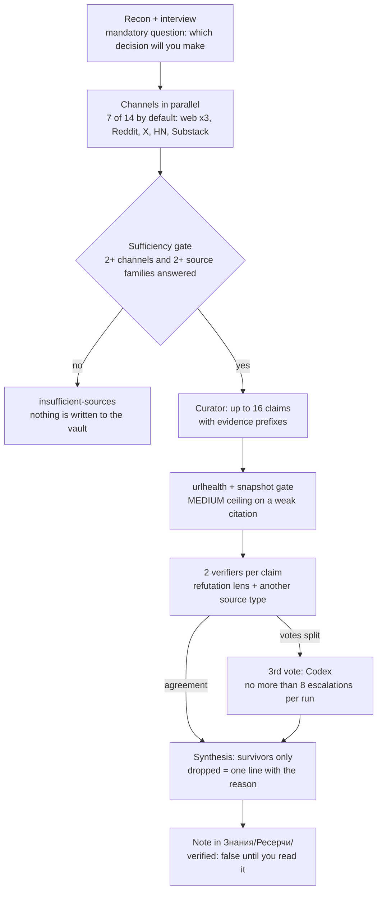

[Русский](README.md) · English

# Tier 3 · Research: `research` and `science-research`

Two plugins on top of the base `search`: `research` — claim verification across many channels, `science-research` — a scientific review that grades how strong the evidence is. Quick web search, `/search`, arrives with the base plugin back in tier 2. Every number below is checked against the plugin code at tags `jadlis-research--v2.0.0` and `jadlis-science-research--v2.0.0`.

## Why

Pick the tool by the question, not by how big the topic feels.

| Question | Tool | What you get |
|---|---|---|
| "What is known about X?" | `/search` | an answer with links in chat + a cost line in the log |
| "Is that still true, and what do practitioners say?" | `/research` | a vault note + a ledger: what held up, what was dropped and why |
| "How strongly is this actually proven?" | `/science-research` | a report with a GRADE rating per outcome |

The fork between the last two is the unit of work. For `research` it is a **claim**: it is checked by counter-search across different types of sources. For `science-research` it is a **paper and its outcome**: the check is bibliographic and methodological.

The problem this solves: half an hour of searching gives you the same thing in seven places. It feels like confirmation, but usually it is one quote everybody copied. Three search engines are one type of source, not three. `research` runs a separate phase that tries to refute each claim and lets only the survivors into the conclusions. `science-research` answers a different question — not "is this true" but "how strongly is it proven" — and that rating can go down, with a stated reason.

## What it looks like

Read the pipeline: collection by channels first, then a separate verification phase, and only then synthesis.




That is the verification phase: one lens hunts for a refutation, the other takes a source of a different type. A disagreement is never averaged — it goes to a third vote.


Channels roll up into source families: `web`, `codexweb`, `grokweb` and `yandex` are one family (the same open web), while Reddit, X, HackerNews, Substack, YouTube, Telegram and the language layers are separate ones. Agreement inside one family does not count as independent confirmation.

<details>
<summary><code>research</code> report fragment (synthetic example)</summary>

```markdown
---
type: research
created: 2026-09-06
ai_drafted: true
verified: false
ai_model: "claude-fable-5-1"
query: "Стоит ли переносить командную вики на статический генератор"
decision: "Решить, мигрировать ли вики команды в этом квартале"
channels: [web, codexweb, reddit, hackernews, substack]
ledger_schema: 4
claims_confirmed: 6
claims_disputed: 1
claims_dropped: 3
escalations: 2
---

> [!success] Verdict for your decision
> Migrate — yes, but not the whole wiki at once: move one section and live on it for a month.

### Confirmed facts
- Search over a static site is solved by an external index, not by the generator (2 votes) [w2·B2]
- The pain threshold is editors without git, not the number of pages (2 votes) [r5·C2]
- Images and attachments are the main source of manual work in a migration (1 vote — split) [hn3·B2]

### Disputed facts
- "The move takes one evening" — votes split, the third vote did not confirm exclusion

> [!note]- Methodology and verification
> Channels: 5, source families: 4. Checked 10 claims: 6 confirmed (1 on a single vote),
> 1 disputed, 3 dropped (2 challenged, 1 outdated), Codex escalations: 2.
> MEDIUM ceiling from the snapshot gate: 2 citations (llm-mediated).
```

The report body itself stays in Russian — it becomes the vault note as is.

</details>


`science-research` is built differently: 9 scientific sources in parallel → citation snowballing (up to 6 hubs per round, 2 rounds max, corpus cap of 120 papers) → link hygiene (batches of 25 DOIs: existence, title match, three retraction signals) → GRADE per outcome → an independent critic → edits with confidence 0.7 and above.

<details>
<summary><code>science-research</code> report fragment (synthetic example)</summary>

```markdown
> [!abstract] TL;DR
> Background speech hurts text retention — moderate certainty [GRADE MODERATE].
> Instrumental background on monotonous tasks — low certainty [GRADE LOW]:
> the effect is absent in part of the studies and small where present.

| Outcome | Design | Papers | Downgrades | GRADE |
|---|---|---|---|---|
| Reading retention | RCT + meta | 12 | inconsistency | MODERATE |
| Speed on a monotonous task | observational | 9 | risk of bias, indirectness | LOW |

Excluded: 1 retracted paper, 2 papers whose title did not match (unverified).
```

</details>

## Install

Add the scientific keys and the external binaries — the base `search` plugin is already in place from tier 2.

Block to hand to an agent:

```text
You are the installer. Do exactly these steps and nothing beyond them:
1. Bash: claude plugin marketplace add https://github.com/beCyborg/jadlis-hub
   (already added — ignore the message and move on)
2. Bash: claude plugin install jadlis-research@jadlis, then claude plugin install jadlis-science-research@jadlis
   (both pull the base search; skip whatever is already installed)
3. Bash: for b in uv jq pdftotext yt-dlp; do command -v $b >/dev/null && echo "$b ok" || echo "$b MISSING"; done
4. Bash: install exactly what is MISSING — brew install uv / brew install jq /
   brew install poppler (provides pdftotext) / brew install yt-dlp
5. Run the skill /jadlis-search:keys and follow it through to the PASS/FAIL table.
6. Tell me: which keys were stored, which table rows are FAIL, and which keys still need signing up for.
```

The manual path uses the same commands:

```bash
claude plugin marketplace add https://github.com/beCyborg/jadlis-hub
claude plugin install jadlis-research@jadlis
claude plugin install jadlis-science-research@jadlis
for b in uv jq pdftotext yt-dlp; do command -v $b >/dev/null && echo "$b ok" || echo "$b MISSING"; done
brew install uv jq poppler yt-dlp   # install only what came back MISSING
```

Then `/jadlis-search:keys`: the skill takes values one at a time, stores them in the macOS Keychain (class B: service `jadlis`, account = the key name) and prints a PASS/FAIL smoke table per source. Key values are never shown — not in the answer, not in Bash echo.

| Key | Needed for | Without it |
|---|---|---|
| `PUBMED_API_KEY` + `PUBMED_EMAIL` | PubMed | 3 requests/s instead of 10, risk of an IP block |
| `SEMANTIC_SCHOLAR_API_KEY` | Semantic Scholar, snowballing | the shared anonymous pool, unpredictable throttling |
| `OPENALEX_API_KEY` + `OPENALEX_MAILTO` | OpenAlex, snowballing | a tighter daily cost budget |
| `CROSSREF_MAILTO`, `UNPAYWALL_EMAIL` | DOI and retraction checks, open-access lookup | outside the polite pool, harsher limits |
| Optional: `EXA_API_KEY`, `CORE_API_KEY`, `YC_SEARCH_API_KEY`, `GOOGLE_PLACES_API_KEY` | semantic layer of `/search`, extra source, the `yandex` channel, the place layer | that layer or channel simply stays off |

Sign-ups are free and hand you a key immediately: PubMed at `ncbi.nlm.nih.gov/account/settings/`, Semantic Scholar at `semanticscholar.org/product/api`, OpenAlex at `openalex.org`, CORE at `core.ac.uk/services/api`. Crossref and Unpaywall have no sign-up at all: they only need your own contact address, which is how those APIs know who is knocking.

Where things land: reports go to `VAULT_PATH/Знания/Ресерчи/` (`VAULT_PATH` is set when `research` and `science-research` are installed, `~/Jadlis` by default), the working files of a run to `VAULT_PATH/.full-research/<id>_<slug>/` and `VAULT_PATH/.search-paper/<id>_<slug>/`.

> [!warning] `GOOGLE_PLACES_API_KEY` — budget cap first
> The Places API has no hard cap by design: overspending is stopped only by a budget alert that disables billing. Set the cap in the Google Cloud Console **before** the first call. Without the key the place layer falls back to Brave Place on its own — that is the normal path.

## Usage

Pick the scenario that matches your question — one per tool.

**1. A quick question — `/search`**

```text
/search what is known about static wiki generators in 2026
```

You get: an answer with a source link under each fact and any disagreements between sources called out. The engine follows the intent: research/news/freshness go to Brave; "describe the target page", people/company/publication go to Exa. A full page is `contents <url> --full`, a PDF goes through `pdf-fetch.sh` at zero credits.

**2. Claim verification — `/research`**

```text
/research should we move the team wiki to a static generator
```

You get: an interview first (the opening question is always "which decision will you make from this"), then a plan with the chosen channels — approving it is the launch gate. The output is a note in `Знания/Ресерчи/` with three buckets (confirmed / disputed / dropped) plus a summary: which channels delivered, how many claims held up, what was dropped and why.

**3. A scientific review — `/science-research`**

```text
/science-research does background speech hurt reading comprehension
```

You get: three questions (decision, population, scope) plus a separate one — whether to personalise the conclusions against your vault profile. The output is a report with GRADE per outcome, an evidence table and the exclusion list: retracted papers and papers whose title did not match.

Re-running the key smoke test without writing anything: `/jadlis-search:keys --check`.

## Limits and cost

Cost is counted in calls to paid services, not in how long a run takes.

| What | Price | Note |
|---|---|---|
| Brave Search (Search tier) | $0.005 per query | 50 req/s, parallel calls allowed |
| Exa `/search` | $0.007 per query up to 10 results | `/contents` — $0.001 per page per content type |
| Firecrawl scrape | 1 credit per page | PDFs are billed per page — `pdf-fetch.sh` handles them at zero credits |
| Yandex Search API (`yandex` channel) | ≈0.1–0.15 RUB per topic | opt-in, only with `YC_SEARCH_API_KEY` |
| Codex CLI, Grok CLI | inside the ChatGPT and Grok subscriptions | nothing is spent on top of them |

Model cost. In `research` the number of agent calls adds up deterministically: channels + 1 curator + 1 urlhealth + 2 verifiers per claim + up to 8 Codex escalations + 1 analyst. A default run with 7 channels and the full ceiling of 16 claims comes to about 50 calls. The code carries no separate estimate in tokens or money, and this page will not invent one.

What degrades without keys and binaries:

- No `YC_SEARCH_API_KEY` — the `yandex` channel is not offered; forced on, it returns `exit 2` and `sourceQuality=LOW`, and the run continues.
- No `YOUTUBE_API_KEY` — the `youtube` channel lives on Brave `site:youtube.com` plus local transcripts; the `youtube` server shows red in `/mcp`, which is expected.
- No `uv` — `substack-fetch.py` and `yt-transcript.py` break: the `substack` and `youtube` channels fall back to Brave with `sourceQuality=LOW`.
- No `jq` — `hn-fetch.sh` and `places-fetch.sh` stop working; no `pdftotext` — PDFs would go to Firecrawl, where a hook blocks them.
- No Codex or Grok CLI — the `codexweb`, `grokweb` and `twitter` channels drop out, along with the third vote on a verifier split.

What these tools do not do:

- `research` does not check the whole text: the ceiling is 16 claims per run, everything else in the report is collected but unverified.
- "Confirmed" means "survived a counter-search", not "true". The report is marked `verified: false` until you read it yourself.
- Agreement between several search engines is not confirmation — that is one source family.
- `research` does not judge study methodology; "how strongly is this proven" is a question for `science-research`.
- `science-research` grades mostly from abstracts: full texts are read for 6 papers, not for the whole corpus.
