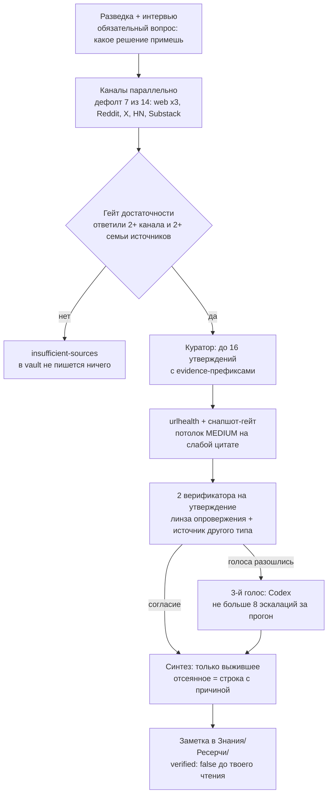

Русский · [English](README.en.md)

# Тир 3 · Ресерч: `research` и `science-research`

Два плагина поверх базового `search`: `research` — проверка утверждений по многим каналам, `science-research` — научный обзор с оценкой силы доказательства. Быстрый веб-поиск `/search` приходит вместе с базой ещё на тире 2. Все числа ниже сверены с кодом плагинов на тегах `jadlis-research--v2.0.0` и `jadlis-science-research--v2.0.0`.

## Зачем

Выбирай инструмент по вопросу, а не по размеру темы.

| Вопрос | Инструмент | Что на выходе |
|---|---|---|
| «Что вообще известно о X?» | `/search` | ответ со ссылками в чате + строка стоимости в лог |
| «Так ли это сейчас и что говорят практики?» | `/research` | заметка в vault + леджер: что подтвердилось, что отсеяно и почему |
| «Насколько сильно это доказано?» | `/science-research` | отчёт с оценкой GRADE по каждому исходу |

Развилка между вторым и третьим — единица работы. У `research` это **утверждение**: его проверяют встречным поиском по источникам разного типа. У `science-research` — **статья и её исход**: проверка библиографическая и методологическая.

Проблема, которую это решает: погуглил полчаса — и одно и то же в семи местах. Ощущается как подтверждение, а обычно это одна цитата, которую переписали все. Три поисковых движка — один тип источника, а не три. `research` отдельной фазой ищет, чем каждое утверждение можно опровергнуть, и в выводы пускает только выжившее. `science-research` отвечает на другой вопрос: не «правда ли это», а «насколько сильно это доказано» — и оценка умеет понижаться с названной причиной.

## Как выглядит

Смотри конвейер: сначала сбор по каналам, потом отдельная фаза проверки, и только потом синтез.




Так работает фаза проверки: одна линза ищет опровержение, вторая берёт источник другого типа. Расхождение не усредняется — уходит на третий голос.


Каналы складываются в семьи источников: `web`, `codexweb`, `grokweb` и `yandex` — одна семья (один и тот же открытый веб), Reddit, X, HackerNews, Substack, YouTube, Telegram и языковые слои — отдельные. Согласие внутри одной семьи независимым подтверждением не считается.

<details>
<summary>Фрагмент отчёта <code>research</code> (синтетический пример)</summary>

```markdown
---
type: research
created: 2026-09-06
ai_drafted: true
verified: false
ai_model: "claude-fable-5-1"
query: "Стоит ли переносить командную вики на статический генератор"
decision: "Решить, мигрировать ли вики команды в этом квартале"
channels: [web, codexweb, reddit, hackernews, substack]
ledger_schema: 4
claims_confirmed: 6
claims_disputed: 1
claims_dropped: 3
escalations: 2
---

> [!success] Вердикт под твоё решение
> Мигрировать — да, но не всю вики сразу: переноси один раздел и живи на нём месяц.

### Проверенные факты
- Поиск по статике решается внешним индексом, а не генератором (2 голоса) [w2·B2]
- Порог боли — редакторы без git, а не объём страниц (2 голоса) [r5·C2]
- Картинки и вложения — главный источник ручной работы при переносе (1 голос — split) [hn3·B2]

### Спорные факты
- «Переезд занимает один вечер» — голоса разошлись, третий голос исключение не подтвердил

> [!note]- Методология и проверка
> Каналы: 5, семей источников: 4. Проверено 10 утверждений: 6 подтверждено (1 одним
> голосом), 1 спорное, 3 отсеяно (2 оспорено, 1 устарело), эскалаций в Codex: 2.
> Потолок MEDIUM по снапшот-гейту: 2 цитаты (llm-mediated).
```

</details>


`science-research` устроен иначе: 9 научных источников параллельно → снежный ком по цитированиям (до 6 хабов за круг, максимум 2 круга, потолок корпуса 120 работ) → гигиена ссылок (батчи по 25 DOI: существование, сверка заголовка, три сигнала отзыва) → GRADE по каждому исходу → независимый критик → правки с уверенностью от 0,7.

<details>
<summary>Фрагмент отчёта <code>science-research</code> (синтетический пример)</summary>

```markdown
> [!abstract] TL;DR
> Фоновая речь мешает удержанию текста — уверенность средняя [GRADE MODERATE].
> Инструментальный фон на монотонных задачах — уверенность низкая [GRADE LOW]:
> эффект есть не во всех работах и мал по величине.

| Исход | Дизайн | Статей | Понижения | GRADE |
|---|---|---|---|---|
| Удержание прочитанного | RCT + мета | 12 | несогласованность | MODERATE |
| Скорость монотонной задачи | наблюдательные | 9 | риск смещения, косвенность | LOW |

Исключено: 1 отозванная работа, 2 работы с несошедшимся заголовком (неверифицированы).
```

</details>

## Как поставить

Заведи научные ключи и внешние бинари — базовый плагин `search` уже стоит с тира 2.

Блок для вставки агенту:

```text
Ты — установщик. Выполни ровно эти шаги и ничего сверх них:
1. Bash: claude plugin marketplace add https://github.com/beCyborg/jadlis-hub
   (если маркетплейс уже добавлен — сообщение об этом пропусти, дальше по списку)
2. Bash: claude plugin install jadlis-research@jadlis, затем claude plugin install jadlis-science-research@jadlis
   (оба тянут базовый search; что уже стоит — пропусти)
3. Bash: for b in uv jq pdftotext yt-dlp; do command -v $b >/dev/null && echo "$b ok" || echo "$b MISSING"; done
4. Bash: для каждого MISSING поставь ровно его — brew install uv / brew install jq /
   brew install poppler (даёт pdftotext) / brew install yt-dlp
5. Запусти скилл /jadlis-search:keys и пройди его до таблицы PASS/FAIL.
6. Скажи мне: какие ключи записаны, какие строки таблицы FAIL и какие ключи ещё надо завести.
```

Ручной путь — те же команды:

```bash
claude plugin marketplace add https://github.com/beCyborg/jadlis-hub
claude plugin install jadlis-research@jadlis
claude plugin install jadlis-science-research@jadlis
for b in uv jq pdftotext yt-dlp; do command -v $b >/dev/null && echo "$b ok" || echo "$b MISSING"; done
brew install uv jq poppler yt-dlp   # ставить только то, что MISSING
```

Дальше `/jadlis-search:keys`: скилл принимает значения по одному, кладёт их в Связку ключей macOS (класс B: служба `jadlis`, account = имя ключа) и печатает смоук-таблицу PASS/FAIL по каждому источнику. Значения ключей не показываются нигде — ни в ответе, ни в эхо Bash.

| Ключ | Нужен для | Без него |
|---|---|---|
| `PUBMED_API_KEY` + `PUBMED_EMAIL` | PubMed | 3 запроса/с вместо 10, риск блокировки IP |
| `SEMANTIC_SCHOLAR_API_KEY` | Semantic Scholar, снежный ком | общий анонимный пул, непредсказуемый троттлинг |
| `OPENALEX_API_KEY` + `OPENALEX_MAILTO` | OpenAlex, снежный ком | дневной cost-бюджет режется |
| `CROSSREF_MAILTO`, `UNPAYWALL_EMAIL` | проверка DOI и отзывов, поиск открытых текстов | вне «вежливого пула», лимиты жёстче |
| Опциональные: `EXA_API_KEY`, `CORE_API_KEY`, `YC_SEARCH_API_KEY`, `GOOGLE_PLACES_API_KEY` | семантический слой `/search`, доп. источник, канал `yandex`, place-слой | слой или канал просто не включается |

Регистрации бесплатные и выдают ключ сразу: PubMed — `ncbi.nlm.nih.gov/account/settings/`, Semantic Scholar — `semanticscholar.org/product/api`, OpenAlex — `openalex.org`, CORE — `core.ac.uk/services/api`. У Crossref и Unpaywall регистрации нет: там нужна только своя контактная почта — по ней API узнают, кто стучится.

Куда всё ложится: отчёты — в `VAULT_PATH/Знания/Ресерчи/` (`VAULT_PATH` задаётся при установке `research` и `science-research`, по умолчанию `~/Jadlis`), рабочие файлы прогона — в `VAULT_PATH/.full-research/<id>_<slug>/` и `VAULT_PATH/.search-paper/<id>_<slug>/`.

> [!warning] `GOOGLE_PLACES_API_KEY` — сначала бюджет-кап
> У Places API нет hard cap by design: перерасход останавливает только budget alert, отключающий billing. Поставь кап в Google Cloud Console **до** первого вызова. Без ключа place-слой сам уходит в Brave Place — это штатно.

## Как пользоваться

Бери сценарий под свой вопрос — по одному на инструмент.

**1. Быстрый вопрос — `/search`**

```text
/search что известно о статических генераторах вики в 2026
```

Получишь: ответ со ссылками на источники под каждым фактом; расхождения между источниками отмечены отдельно. Движок выбирается по интенту: research/новости/свежесть — Brave, «опиши целевую страницу», люди/компании/публикации — Exa. Полная страница — `contents <url> --full`, PDF — через `pdf-fetch.sh` за 0 кредитов.

**2. Проверка утверждений — `/research`**

```text
/research переносить ли командную вики на статический генератор
```

Получишь: сначала интервью (первый вопрос всегда «какое решение ты примешь по итогам»), затем план с выбранными каналами — его одобрение и есть гейт запуска. На выходе заметка в `Знания/Ресерчи/` с тремя корзинами (проверенные / спорные / отсеянные) и сводка: какие каналы отработали, сколько утверждений подтвердилось, что отсеяно и почему.

**3. Научный обзор — `/science-research`**

```text
/science-research мешает ли фоновая речь пониманию прочитанного
```

Получишь: три вопроса (решение, популяция, охват) плюс отдельный — персонализировать ли вывод по профилю из vault. На выходе отчёт с GRADE по каждому исходу, таблицей доказательств и списком исключённого: отозванные работы и работы с несошедшимся заголовком.

Повторный смоук ключей без записи: `/jadlis-search:keys --check`.

## Границы и стоимость

Считай стоимость по вызовам к платным сервисам, а не по времени прогона.

| Что | Цена | Примечание |
|---|---|---|
| Brave Search (тариф Search) | $0,005 за запрос | 50 req/s, параллель разрешена |
| Exa `/search` | $0,007 за запрос до 10 результатов | `/contents` — $0,001 за страницу за тип контента |
| Firecrawl scrape | 1 кредит за страницу | PDF биллится постранично — их ведёт `pdf-fetch.sh` за 0 кредитов |
| Yandex Search API (канал `yandex`) | ≈0,1–0,15 ₽ за тему | opt-in, только с `YC_SEARCH_API_KEY` |
| Codex CLI, Grok CLI | внутри подписок ChatGPT и Grok | сверх подписки не тратится |

Сколько это стоит по модели. В `research` число вызовов агентов складывается детерминированно: каналы + 1 куратор + 1 urlhealth + 2 верификатора на каждое утверждение + до 8 эскалаций в Codex + 1 аналитик. Дефолтный прогон с 7 каналами и полным потолком в 16 утверждений — до 50 вызовов. Отдельной оценки в токенах или деньгах в коде нет, и выдумывать её тут не будем.

Что деградирует без ключей и бинарей:

- Нет `YC_SEARCH_API_KEY` — канал `yandex` не предлагается; выбран принудительно → `exit 2` и `sourceQuality=LOW`, прогон продолжается.
- Нет `YOUTUBE_API_KEY` — канал `youtube` живёт на Brave `site:youtube.com` и локальных транскриптах; сервер `youtube` в `/mcp` горит красным, это ожидаемо.
- Нет `uv` — ломаются `substack-fetch.py` и `yt-transcript.py`: каналы `substack` и `youtube` падают на Brave и `sourceQuality=LOW`.
- Нет `jq` — не работают `hn-fetch.sh` и `places-fetch.sh`; нет `pdftotext` — PDF пойдут в Firecrawl, где их режет хук.
- Нет Codex или Grok CLI — выпадают каналы `codexweb`, `grokweb`, `twitter` и третий голос при расхождении верификаторов.

Чего инструменты не делают:

- `research` не проверяет весь текст: потолок — 16 утверждений за прогон, остальное в отчёте собрано, но не проверено.
- «Подтверждено» означает «выжило после встречного поиска», а не «правда». Отчёт помечен `verified: false`, пока ты не прочитаешь его сам.
- Согласие нескольких поисковых движков подтверждением не считается — это одна семья источников.
- `research` не судит методологию исследований; вопрос «насколько сильно доказано» — к `science-research`.
- `science-research` ставит GRADE в основном по абстрактам: полные тексты читаются у 6 работ, а не у всего корпуса.
